<!-- ========================================================= -->
<!-- Hero Banner -->
<!-- ========================================================= -->

<h1 align="center">
🛡️ SentinelSIEM
</h1>

<p align="center">
<strong>A Modern Security Information and Event Management Platform for Centralized Security Operations</strong>
</p>

<p align="center">
Security Monitoring • Detection & Response • Incident Management • Threat Intelligence • RBAC • Auditability
</p>

<p align="center">
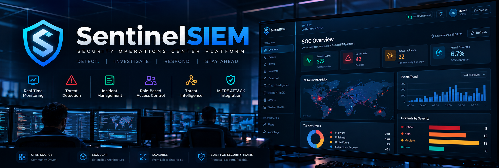
</p>

<p align="center">     </p>

---

# 📖 Overview

**SentinelSIEM** is a modern **Security Information and Event Management (SIEM)** platform for centralized security monitoring, detection, investigation, and response.

It provides a unified interface for:

- 🛡️ Security monitoring
- 🚨 Alerts & incidents
- 🔎 Detection & investigation
- 🌐 Threat intelligence
- 🗺️ MITRE ATT&CK
- 🖥️ Asset management
- 🔐 Authentication & RBAC
- 👤 User management
- 📋 Centralized audit logging

### 🌐 Application

```text
http://localhost:8000
```

---

# 📑 Table of Contents

- [📖 Overview](#-overview)
- [🎯 Project Goals](#-project-goals)
- [✨ Features](#-features)
- [🏗️ System Architecture](#️-system-architecture)
- [🔐 Authentication & Authorization](#-authentication--authorization)
- [👥 Role-Based Access Control](#-role-based-access-control)
- [📋 Audit Architecture](#-audit-architecture)
- [🔄 Security Operations Workflow](#-security-operations-workflow)
- [🛡️ Security Operations](#️-security-operations)
  - [SOC Overview](#soc-overview)
  - [Events](#events)
  - [Alerts](#alerts)
  - [Incidents](#incidents)
  - [Detection](#detection)
  - [Threat Intelligence](#threat-intelligence)
  - [MITRE ATT&CK](#mitre-attck)
  - [Assets](#assets)
  - [System Health](#system-health)
- [👤 Administration](#-administration)
  - [User Management](#-user-management)
  - [Audit Logs](#-audit-logs)
- [📁 Project Structure](#-project-structure)
- [🛠️ Installation](#️-installation)
- [🚀 Usage](#-usage)
- [🧪 Testing](#-testing)
- [🗺️ Roadmap](#-roadmap)
- [🤝 Contributing](#-contributing)
- [🔐 Security Considerations](#-security-considerations)
- [📄 License](#-license)
- [🙏 Acknowledgements](#-acknowledgements)
- [👨‍💻 Author](#-author)

---

# 🎯 Project Goals

SentinelSIEM focuses on building a centralized, secure, and scalable foundation for security operations.

- Centralized event and alert monitoring
- Detection and incident investigation
- Threat intelligence and MITRE ATT&CK
- Asset and SOC visibility
- Authentication, authorization, and RBAC
- User and session management
- Centralized security auditing
- Secure API architecture
- Containerized deployment
- Automated testing

---

# ✨ Features

## 🛡️ Security Operations

- SOC dashboard
- Events and alerts
- Incident management
- Detection
- Threat intelligence
- MITRE ATT&CK
- Asset management
- System health

## 🔐 Authentication & Security

- Secure authentication
- Password management and reset
- Account lock/unlock
- Account enable/disable
- Session management and revocation
- Authorization and RBAC

## 👥 User Management

- User dashboard
- User search and filtering
- User creation and details
- Role management
- Account management
- Password administration
- Session management
- User audit history

## 📋 Auditability

- Centralized audit logging
- Actor and target tracking
- Action and outcome tracking
- Source IP and timestamp tracking
- Audit filtering
- Related events
- Audit export

---

# 🏗️ System Architecture

SentinelSIEM uses a layered architecture separating the frontend, API, business logic, data access, and storage.

```text
Web Browser
     │
     ▼
Frontend UI
     │
     ▼
FastAPI API
     │
     ▼
Service Layer
     │
     ▼
Repository Layer
     │
     ▼
Database
```

---

# 🔐 Authentication & Authorization

SentinelSIEM separates **authentication** from **authorization** to securely control access to platform resources.

## Authentication

- User login
- Password verification
- Session management
- Password changes and reset
- Forced password changes
- Account state validation
- Session revocation

## Authorization

- Resource access control
- Create, update, and delete operations
- User and role management
- Administrative operations
- Protected audit access
- Role and permission enforcement

---

# 👥 Role-Based Access Control

SentinelSIEM uses Role-Based Access Control (RBAC).

The application defines five primary roles:

| Role | Description |
|---|---|
| `ADMIN` | Administrative and security-management access |
| `SECURITY_ANALYST` | Security analysis and investigation capabilities |
| `SOC_ANALYST` | SOC monitoring and operational security capabilities |
| `INVESTIGATOR` | Investigation-focused capabilities |
| `VIEWER` | Read-oriented access to permitted resources |

---

# 📋 Audit Architecture

SentinelSIEM uses a centralized audit architecture with a single canonical audit source:

```text
siem_auth_audit
```

Both **Global Audit Logs** and **User Audit History** use the same audit pipeline.

```text
Security-Sensitive Action
          │
          ▼
     Application
          │
          ▼
     AuditService
          │
          ▼
   AuditRepository
          │
          ▼
   siem_auth_audit
```

Audit records include:

- Actor and target
- Action and outcome
- Source IP and timestamp
- Resource and related-event information
- Technical identifiers

Human-readable identities are displayed in the UI, while technical identifiers are available in detailed views.

---

# 🔄 Security Operations Workflow

SentinelSIEM follows a structured security operations workflow:

```text
Events
  ↓
Detection
  ↓
Alerts
  ↓
Investigation
  ↓
Incident
  ↓
Response / Resolution
  ↓
Audit / Review
```

Threat intelligence and asset context can support the investigation throughout the workflow.

---

# 🛡️ Security Operations

## SOC Overview

Centralized security operations dashboard providing visibility into:

- Events and alerts
- Incidents and detections
- Threat intelligence
- Assets and system health

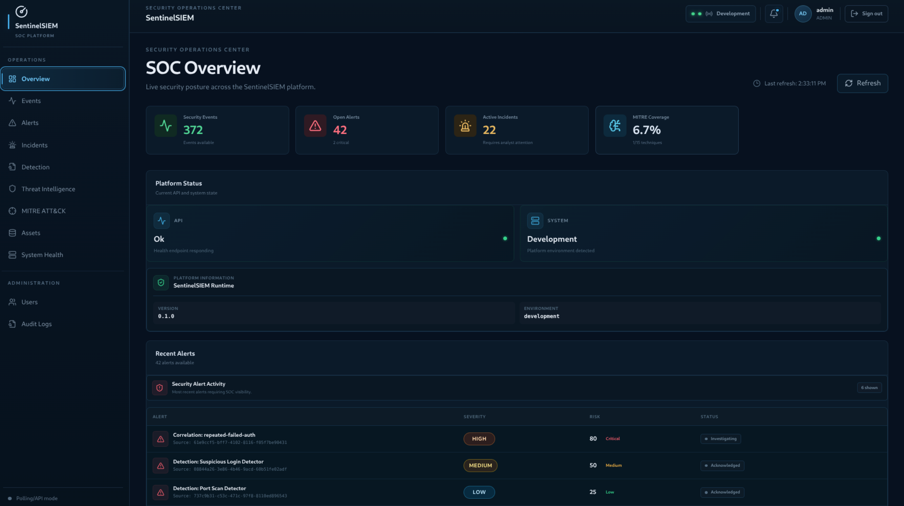

---

## Events

Monitored security activity with relevant event and detection context.

- Timestamp
- Source / Destination
- Event type and severity
- User and asset
- Network and detection context

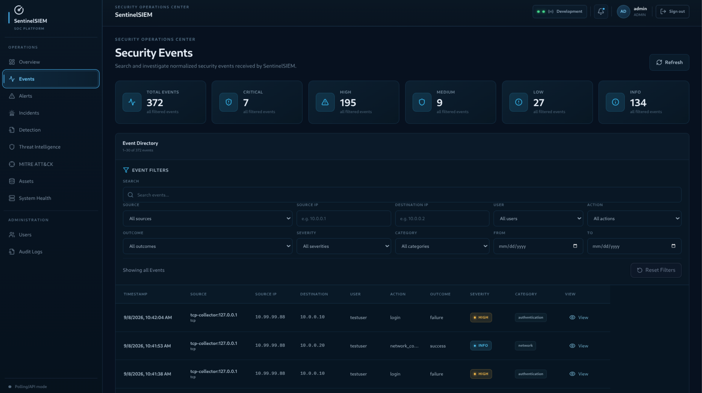

---

## Alerts

Security conditions requiring analyst attention.

- Severity and detection source
- Related events
- Source / Destination
- Asset and investigation context

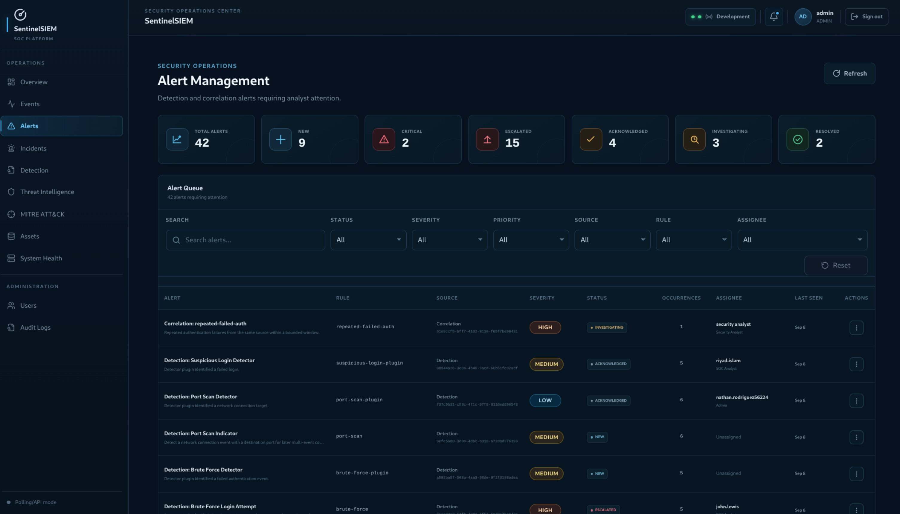

---

## Incidents

Structured investigation and case management.

- Severity and status
- Related alerts and events
- Assigned analyst
- Investigation and resolution details

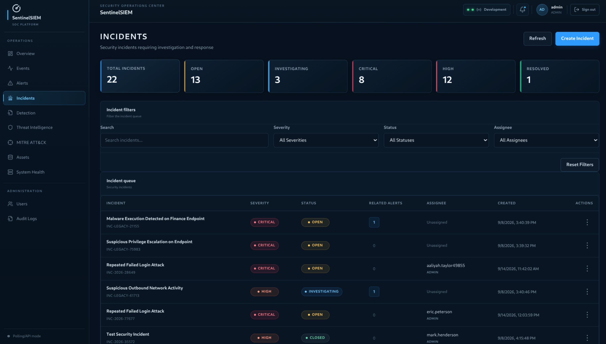

---

## Detection

Identifies potentially suspicious activity using:

- Rules and patterns
- Indicators
- Behavioral conditions
- Threat intelligence
- Correlation logic

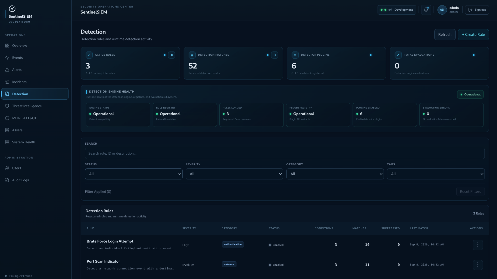

---

## Threat Intelligence

Provides contextual intelligence for security investigations, including:

- IP addresses
- Domains and URLs
- File hashes
- Malware indicators
- Threat actors and campaigns

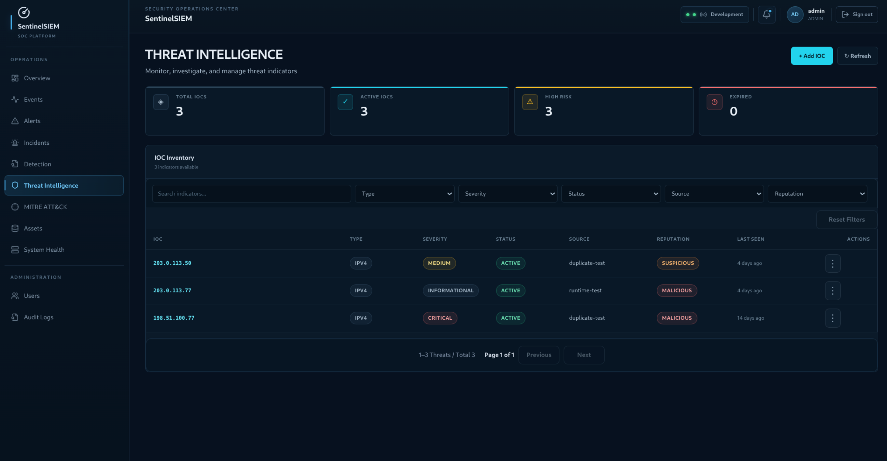

---

## MITRE ATT&CK

Provides structured adversary-behavior context through:

- Tactics
- Techniques
- Sub-techniques
- Procedures
- Detection opportunities

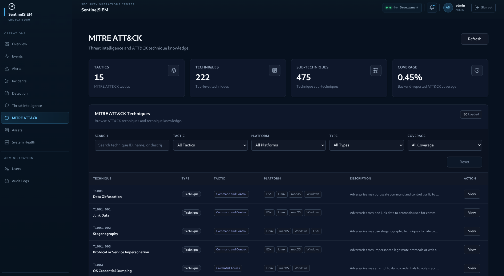

---

## Assets

Provides visibility into monitored infrastructure:

- Servers and endpoints
- Workstations
- Network systems
- Applications
- Cloud resources

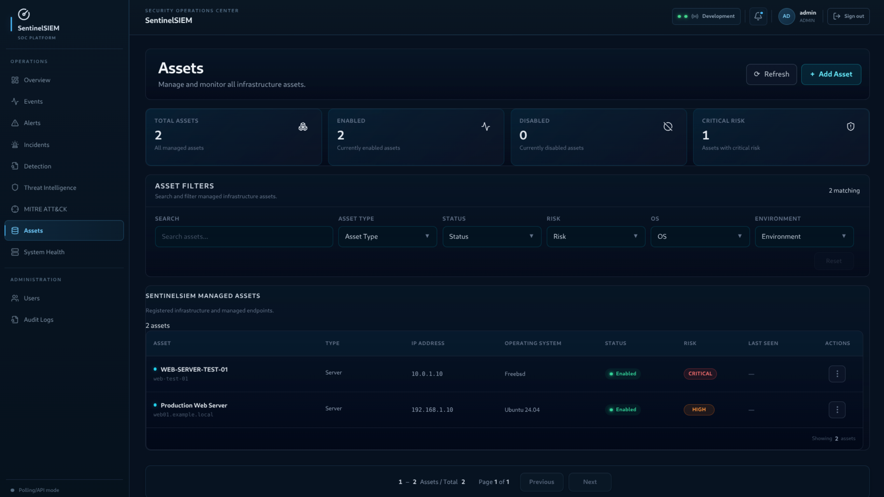

---

## System Health

Provides operational visibility into:

- Application and backend status
- Database connectivity
- Service availability
- Resource usage
- System errors

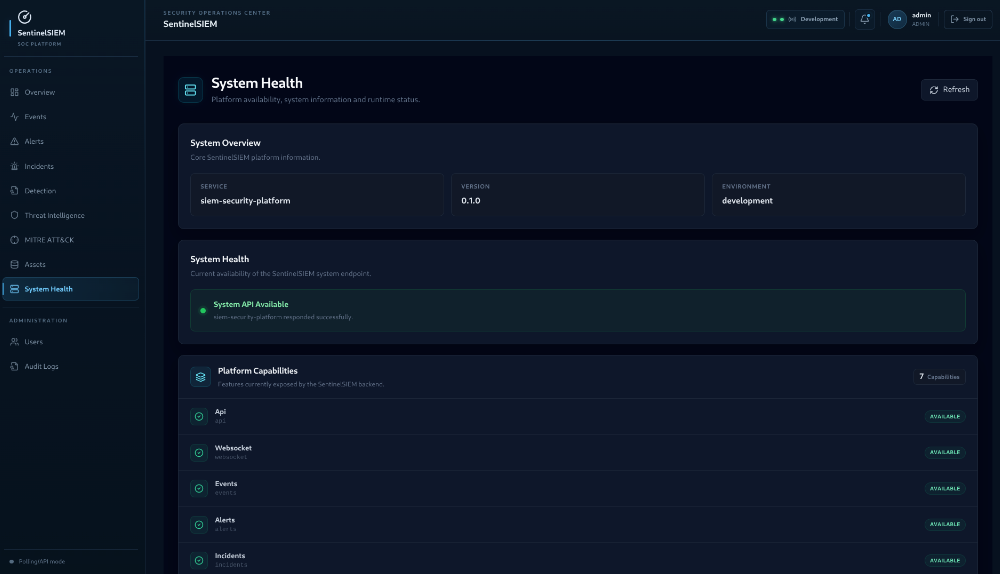

---

# 👤 Administration

Provides authorized administrative controls for:

- User management
- Role and account management
- Session management
- Password administration
- Audit logs

---

# 👥 User Management

Centralized user lifecycle and account management.

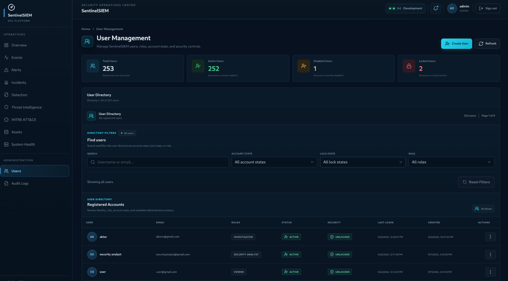

- User dashboard and filtering
- User creation and details
- Role management
- Enable / disable
- Lock / unlock
- Password reset
- Force password change
- Session management
- User audit history

### Available Roles

```text
ADMIN
SECURITY_ANALYST
SOC_ANALYST
INVESTIGATOR
VIEWER
```

---

# 📋 Audit Logs

Centralized visibility into security-sensitive application activity.

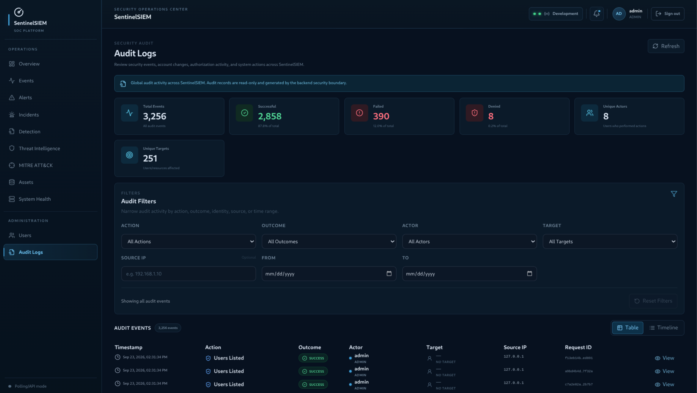

### Audit Filters

| Filter | Purpose |
|---|---|
| Action | Audit action |
| Outcome | Operation result |
| Actor | Event actor |
| Target | Event target |
| Source IP | Source address |
| From Date | Start date |
| To Date | End date |

Additional capabilities:

- Audit details
- Related events
- Export
- Filtered and unfiltered views

The interface uses **Apply Filters** to execute selected filters and **Reset Filters** to restore the unfiltered view.

---

# 📁 Project Structure

SentinelSIEM follows a modular architecture with dedicated components for security operations, authentication, detection, storage, deployment, and frontend management.

```text
SentinelSIEM/
├── alembic/                     # Database migrations
│
├── backend/
│   ├── app/
│   │   ├── alerts/              # Alert management
│   │   ├── api/                 # API routes, schemas & WebSockets
│   │   ├── assets/              # Asset management
│   │   ├── audit/               # Centralized audit system
│   │   ├── auth/                # Authentication, RBAC & sessions
│   │   ├── correlation/         # Event correlation engine
│   │   ├── detection/           # Detection engine & rules
│   │   ├── incidents/           # Incident management
│   │   ├── ingestion/           # Event ingestion & collectors
│   │   ├── mitre/               # MITRE ATT&CK integration
│   │   ├── parsing/             # Event parsing & normalization
│   │   ├── risk/                # Risk scoring
│   │   ├── storage/             # PostgreSQL, Redis & OpenSearch
│   │   └── threat_intelligence/ # Threat intelligence
│   │
│   ├── plugins/                 # Detection plugins
│   └── rules/                   # Backend detection rules
│
├── frontend/
│   └── src/
│       ├── components/           # Shared UI components
│       ├── modules/              # Security operation modules
│       ├── auth/                 # Frontend RBAC
│       ├── pages/                # Application pages
│       ├── services/             # API & WebSocket services
│       └── styles/               # Global styles
│
├── config/                      # Application configuration
├── deployment/                  # Docker, Compose, Kubernetes & production
├── docs/                        # Architecture & development documentation
├── observability/               # Monitoring, metrics & health
├── plugins/                     # Detection plugin implementations
├── rules/                       # Detection & correlation rules
├── scripts/                     # Utility scripts
├── tools/                       # Development & testing tools
├── images/                      # README screenshots
│
├── .github/
│   └── workflows/               # CI/CD & security automation
│
├── .env
├── pyproject.toml
├── Makefile
├── SECURITY.md
├── LICENSE
└── README.md
```

---

# 🛠️ Installation

## 1. Clone the Repository

```bash
git clone https://github.com/sahadatx/SentinelSIEM.git
```

## 2. Enter the Project

```bash
cd SentinelSIEM
```

## 3. Start the Application

```bash
docker compose up -d
```

## 4. Check Container Status

```bash
docker compose ps
```

## 5. Open the Application

```text
http://localhost:8000
```

---

# 🚀 Usage

## Start SentinelSIEM

```bash
docker compose up -d
```

## Check Services

```bash
docker compose ps
```

## View Logs

```bash
docker compose logs
```

For a specific service:

```bash
docker compose logs <service-name>
```

## Follow Logs

```bash
docker compose logs -f
```

## Stop SentinelSIEM

```bash
docker compose down
```

## Restart SentinelSIEM

```bash
docker compose restart
```

---

# 🧪 Testing

SentinelSIEM includes automated tests for critical application functionality.

## Run All Tests

```bash
pytest -q
```

## Run User Management Tests

```bash
pytest -q backend/tests/auth/test_user_management.py
```

## Run Backend Tests

```bash
pytest -q backend/tests/
```

Testing covers:

- Authentication
- Authorization
- RBAC
- User management
- Session management
- Audit functionality
- API behavior
- Security-sensitive workflows
- Application business logic

---

# 🗺️ Roadmap

## ✅ Implemented Areas

- Core application architecture
- Authentication
- Authorization
- RBAC
- User management
- Session management
- Password management
- Audit architecture
- Global audit logs
- User audit history
- Security operations foundation
- Docker-based deployment
- Automated testing

## 🚧 Future Improvements

- Advanced event ingestion
- Real-time event streaming
- Advanced detection rules
- Detection rule management
- Correlation engine
- Automated response
- Advanced incident workflows
- Threat intelligence enrichment
- IOC management
- Malware analysis integration
- Advanced MITRE ATT&CK mapping
- Endpoint telemetry
- Network telemetry
- Cloud security integrations
- Notification systems
- Advanced reporting
- Security analytics
- Performance optimization
- Horizontal scalability

---

# 🤝 Contributing

Contributions are welcome.

Before submitting a change:

1. Understand the existing architecture.
2. Keep security requirements in mind.
3. Avoid unnecessary architectural changes.
4. Add or update tests.
5. Keep APIs backward-compatible where applicable.
6. Follow the existing project structure.
7. Document important changes.
8. Verify the complete test suite.

## Development Workflow

```text
Edit
  ↓
Save
  ↓
Browser Refresh
  ↓
Verify
  ↓
Run Tests
  ↓
Commit
```

Application entry point:

```text
http://localhost:8000
```

---

# 🔐 Security Considerations

When deploying SentinelSIEM outside a local development environment:

- Use strong credentials.
- Protect authentication secrets.
- Use HTTPS.
- Restrict database access.
- Protect administrative endpoints.
- Apply least-privilege access.
- Rotate secrets appropriately.
- Monitor audit logs.
- Protect exported audit data.
- Keep dependencies updated.
- Do not commit secrets to Git.
- Restrict access to production infrastructure.
- Use appropriate network segmentation.

---

# 📄 License

This project is licensed under the MIT License.

See the [`LICENSE`](LICENSE) file for the complete license text.

---

# 🙏 Acknowledgements

SentinelSIEM is built using and inspired by the broader open-source security and software-development ecosystem.

Special thanks to:

- Python
- FastAPI
- Docker
- Linux
- MITRE ATT&CK
- Open-source security tooling
- Cybersecurity research communities

---

# 👨‍💻 Author

**Sahadat Hossain**

Cybersecurity Researcher • Penetration Tester • Python Developer

### Contact

- 📧 **Email:** [pentester.sahadathossain@gmail.com](mailto:pentester.sahadathossain@gmail.com)
- 💼 **LinkedIn:** [linkedin.com/in/pentester-sahadat-hossain](https://www.linkedin.com/in/pentester-sahadat-hossain/)
- 🐙 **GitHub:** [github.com/sahadatx](https://github.com/sahadatx)
- 🌐 **Portfolio:** [sahadatx.github.io/Personal-Portfolio](https://sahadatx.github.io/Personal-Portfolio/)

> Feel free to connect for collaboration, security research, or open-source contributions.

---

If you found this project useful, consider supporting it by:

- ⭐ Starring the repository
- 🍴 Forking the project
- 🤝 Contributing improvements
- 📢 Sharing it with others

---

<p align="center">
Made with ❤️ by <strong>Sahadat Hossain</strong>
</p>

<p align="right">
<a href="#-overview">⬆️ Back to Top</a>
</p>